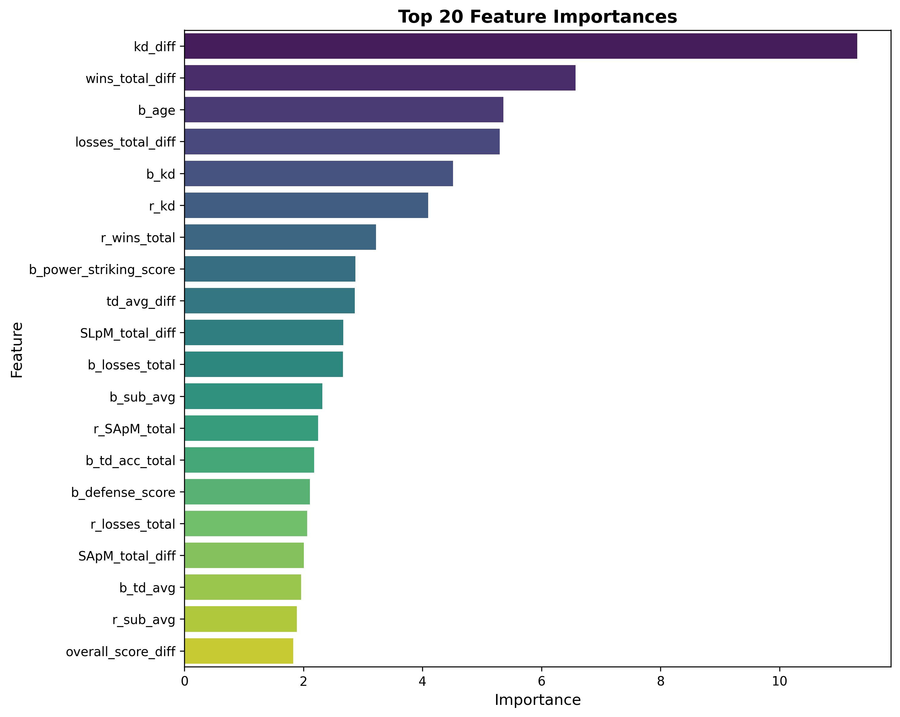

# A Comparative Machine Learning Study

A comprehensive machine learning pipeline that compares multiple classification algorithms for predicting UFC fight outcomes. This project demonstrates end-to-end ML workflow including exploratory data analysis, feature engineering, model training, and hyperparameter optimization.

## Project Overview

This project presents a systematic comparison of machine learning models for binary classification tasks. Using UFC fighter statistics and historical fight data, the study evaluates how different algorithms perform across standardized preprocessing and feature engineering pipelines.

The primary objective is not merely to predict fight outcomes, but to analyze and compare the performance characteristics of various classification algorithms under controlled conditions. Each model is evaluated using consistent metrics, enabling direct performance comparison and identification of the optimal approach for this classification problem.

### Dataset

**Source**: [UFC Fighters & Fight Data - Kaggle](https://www.kaggle.com/datasets/rajeevw/ufcdata)

The dataset contains comprehensive UFC fighter statistics and historical fight results, including:
- Fighter physical attributes (height, weight, reach, age)
- Career statistics (wins, losses, knockouts, submissions)
- Performance metrics (strikes per minute, takedown accuracy, defense statistics)
- Fight-specific information (weight class, title bout status)

Total samples: 7,439 fights with 95 original features before preprocessing.

### Key Components

**Models Evaluated**:
- Logistic Regression
- K-Nearest Neighbors (KNN)
- Decision Tree
- Random Forest
- Gradient Boosting
- XGBoost
- LightGBM
- CatBoost

**Pipeline Stages**:
1. Exploratory Data Analysis (EDA)
2. Feature Engineering
3. Baseline Model Training
4. Hyperparameter Tuning

**Evaluation Metrics**:
- Accuracy
- F1 Score (weighted)
- ROC-AUC Score

### Expected Outcomes

- Quantitative comparison of classification performance across eight machine learning algorithms
- Identification of the best-performing model for UFC fight prediction
- Performance improvement through systematic hyperparameter optimization
- Feature importance analysis for model interpretability

### Technology Stack

**Core Libraries**:
- Python 3.11
- pandas, NumPy (data manipulation)
- scikit-learn (preprocessing, baseline models, evaluation)
- XGBoost, LightGBM, CatBoost (gradient boosting frameworks)
- matplotlib, seaborn (visualization)

## Installation

### Prerequisites

Python 3.11 is required for this project. Note that Python 3.13 is not compatible with some dependencies. All results in this documentation were generated using Python 3.11.

### Quick Setup

Create and activate a virtual environment:

```bash
python3.11 -m venv venv
source venv/bin/activate  # On Windows: venv\Scripts\activate
```

Install all dependencies:

```bash
pip install -r requirements.txt
```

To activate the environment in future sessions:

```bash
source venv/bin/activate  # On Windows: venv\Scripts\activate
```

### Project Structure

```
.
├── data/
│   ├── raw/              # Original dataset
│   └── processed/        # Processed data after feature engineering
├── models/
│   └── saved_models/     # Trained model artifacts
├── src/
│   ├── EDA.py                    # Exploratory data analysis
│   ├── feature_engineering.py    # Feature creation and preprocessing
│   ├── base_model_training.py    # Baseline model training
│   └── model_tuning.py           # Hyperparameter optimization
├── main.py               # Pipeline execution
└── requirements.txt
```

## Running the Pipeline

Execute the complete pipeline:

```bash
python main.py
```

The pipeline can also be run stage-by-stage by modifying the execution block in `main.py`:

```python
# Full pipeline
pipeline.run_full_pipeline()

# Or run individual stages:
# pipeline.run_eda()
# pipeline.run_feature_engineering()
# pipeline.train_baseline_models()
# pipeline.tune_best_model()
# pipeline.save_artifacts()
```

This modular approach allows you to:
- Resume from any stage after initial data preparation
- Skip stages when iterating on specific components
- Debug individual pipeline stages independently

---

## Pipeline Walkthrough

### Exploratory Data Analysis (EDA)

```
→ Stage 1: Exploratory Data Analysis

  Loading dataset...
  ◦ Data loaded: 7,439 rows × 95 columns

  Target distribution:
    • Red:  65.5% (4,876 samples)
    • Blue:  34.5% (2,563 samples)

  Missing values detected in 10 columns:
    • reach_diff: 1,038 missing (13.95%)
    • b_reach: 888 missing (11.94%)
    • r_reach: 412 missing (5.54%)
    • age_diff: 213 missing (2.86%)
    • b_age: 190 missing (2.55%)
    • r_age: 76 missing (1.02%)
    • b_stance: 68 missing (0.91%)
    • referee: 32 missing (0.43%)
    • total_rounds: 31 missing (0.42%)
    • r_stance: 26 missing (0.35%)

  Dropping 42 unnecessary columns:
    • Fight outcome: method, finish_round, time_sec
    • Event metadata: event_name, referee
    • Per-fight stats: r_sig_str, r_sig_str_att, r_sig_str_acc, ... (21 more)
    • Redundant differences: kd_diff, sig_str_diff, sig_str_att_diff, ... (10 more)

  ◦ Final dataset: 7,439 rows × 53 columns
```

The EDA stage performs initial data inspection and cleaning:

**Data Loading**: The raw dataset contains 7,439 UFC fights with 95 features covering fighter statistics, physical attributes, and fight-specific metrics.

**Target Variable Analysis**: The dataset shows class imbalance with Red corner winners at 65.5% and Blue corner winners at 34.5%. This imbalance is inherent to UFC data where the Red corner typically designates the higher-ranked fighter.

**Missing Value Assessment**: Ten columns contain missing values, primarily in physical measurements such as reach (13.95% missing) and fighter metadata. The highest missing percentage is 13.95% in reach_diff, which will be addressed in the feature engineering stage.

**Column Removal**: Forty-two columns are removed to prevent data leakage and reduce dimensionality:
- Fight outcome variables (method, finish_round, time_sec) would leak information about the target
- Event metadata (event_name, referee) provides no predictive value
- Per-fight statistics (significant strikes, takedowns per fight) are post-hoc measurements unavailable before the fight
- Redundant difference features already calculated in the dataset

After cleaning, the dataset contains 53 features ready for feature engineering.

### Feature Engineering

```
→ Stage 2: Feature Engineering

  Creating new features...

  BMI features (2):
    • r_body_mass_index: Red corner BMI
    • b_body_mass_index: Blue corner BMI

  Difference features (15):
    • wins_total_diff, losses_total_diff
    • age_diff, height_diff, weight_diff, reach_diff
    • SLpM_total_diff, SApM_total_diff
    • sig_str_acc_total_diff, td_acc_total_diff
    • str_def_total_diff, td_def_total_diff
    • sub_avg_diff, td_avg_diff, kd_diff

  Comparative features (5):
    • is_r_younger: Red fighter is younger
    • is_r_taller: Red fighter is taller
    • is_r_more_experienced: Red fighter has more wins
    • is_r_better_td_acc: Red fighter has better takedown accuracy
    • same_stance: Both fighters have same stance

  Power & defense features (5):
    • r_power_striking_score, b_power_striking_score
    • r_defense_score, b_defense_score
    • overall_score_diff: Combined performance differential

  Data preprocessing...
  ◦ Missing values: 2,942 → 0 (median for numeric, mode for categorical)
  ◦ Outliers capped: 31,616 values (5th-95th percentile range)
  ◦ Target encoded: Blue=0, Red=1
  ◦ Dropped redundant features: r_height, r_weight, b_height, b_weight, r_reach, b_reach

  ◦ Feature engineering complete: 7,439 rows × 60 columns
```

Feature engineering transforms raw fighter statistics into informative predictors:

**BMI Features (2 new features)**: Body Mass Index is calculated for both fighters using the standard formula: weight (kg) / height² (m²). BMI provides a normalized measure of body composition that may indicate fighting style or weight class characteristics.

**Difference Features (15 new features)**: Rather than using absolute statistics for each fighter, difference features capture the relative advantage between opponents:
- Record differentials: wins_total_diff, losses_total_diff
- Physical differentials: age_diff, height_diff, weight_diff, reach_diff
- Performance differentials: SLpM (strikes landed per minute), SApM (strikes absorbed per minute), striking accuracy, takedown accuracy, defensive statistics, submission averages, and knockdown counts

This approach reduces feature dimensionality while highlighting competitive advantages.

**Comparative Features (5 new features)**: Binary indicators encode which fighter has specific advantages:
- is_r_younger: Age advantage for Red corner
- is_r_taller: Height advantage for Red corner
- is_r_more_experienced: Win count advantage for Red corner
- is_r_better_td_acc: Takedown accuracy advantage for Red corner
- same_stance: Whether fighters share the same fighting stance (orthodox, southpaw, etc.)

**Power & Defense Scores (5 new features)**: Composite metrics combine multiple statistics:
- Power striking score: Product of striking volume (SLpM) and accuracy
- Defense score: Sum of striking defense and takedown defense percentages
- Overall score differential: Weighted combination of offensive and defensive metrics (40% striking, 30% strike defense, 30% takedown defense)

**Missing Value Imputation**: The 2,942 missing values across the dataset are filled using:
- Median imputation for numerical features (robust to outliers)
- Mode imputation for categorical features (most frequent value)

**Outlier Treatment**: 31,616 values (approximately 7% of all numerical data points) are capped at the 5th and 95th percentiles. This Winsorization approach preserves data distribution while limiting the influence of extreme values that may represent data errors or anomalies.

**Target Encoding**: The winner column is label-encoded: Blue=0, Red=1, preparing the target variable for binary classification.

**Feature Reduction**: After creating difference features, the original absolute measurements (heights, weights, reaches) are dropped to prevent multicollinearity and reduce model complexity.

The final dataset contains 60 features engineered for optimal predictive power.

### Model Training (Baseline)

```
→ Stage 3: Baseline Model Training
  ◦ Data split: 5,951 train / 1,488 test (80/20)
  ◦ Scaling applied: RobustScaler

  Training 8 baseline models...

  Results (ranked by F1 score):
    1. CatBoost               F1: 0.814  Acc: 0.817  AUC: 0.894  ✓
    2. Gradient Boosting      F1: 0.809  Acc: 0.813  AUC: 0.886
    3. Random Forest          F1: 0.806  Acc: 0.811  AUC: 0.878
    4. LightGBM               F1: 0.804  Acc: 0.806  AUC: 0.885
    5. Logistic Regression    F1: 0.804  Acc: 0.806  AUC: 0.879
    6. XGBoost                F1: 0.797  Acc: 0.800  AUC: 0.875
    7. KNN                    F1: 0.706  Acc: 0.714  AUC: 0.753
    8. Decision Tree          F1: 0.706  Acc: 0.705  AUC: 0.679

  ◦ Best performing model: CatBoost
```

Eight classification algorithms are trained and evaluated under identical conditions:

**Data Preparation**: The dataset is split into training (5,951 samples, 80%) and test (1,488 samples, 20%) sets using stratified sampling to preserve class distribution. RobustScaler is applied to normalize features, chosen for its resistance to outliers through use of the interquartile range.

**Model Training**: All models are trained with default hyperparameters to establish baseline performance. This approach ensures fair comparison by eliminating the confounding effects of hyperparameter tuning.

**Performance Analysis**:

**Top Tier (F1 > 0.80)**:
- CatBoost achieves the highest performance across all metrics (F1: 0.814, Accuracy: 0.817, AUC: 0.894), demonstrating superior handling of categorical features and class imbalance
- Gradient Boosting follows closely (F1: 0.809), showing that ensemble methods excel on this structured data
- Random Forest and LightGBM perform similarly (F1: 0.806, 0.804), validating the effectiveness of tree-based ensembles

**Mid Tier (F1 > 0.79)**:
- Logistic Regression achieves competitive performance (F1: 0.804) despite its simplicity, suggesting the engineered features provide strong linear separability
- XGBoost underperforms relative to other gradient boosting frameworks (F1: 0.797), possibly due to suboptimal default hyperparameters for this specific problem

**Lower Tier (F1 < 0.72)**:
- KNN struggles with the high-dimensional feature space (F1: 0.706), suffering from the curse of dimensionality
- Decision Tree shows signs of overfitting with the lowest test performance (F1: 0.706, AUC: 0.679)

**Key Observations**:
- Gradient boosting frameworks (CatBoost, Gradient Boosting, LightGBM) dominate the top positions
- Tree-based ensembles outperform linear models and instance-based learners
- The performance gap between best (0.814) and worst (0.679) F1 scores is 0.135, indicating substantial model-specific differences

CatBoost is selected for hyperparameter tuning based on its superior baseline performance.

### Hyperparameter Tuning (CatBoost)

```
→ Stage 4: Hyperparameter Tuning

  Baseline CatBoost performance:
    • CV F1 Score: 0.854
    • CV Accuracy: 0.802

  Running RandomizedSearchCV...
  ◦ Search space: 4 parameters
  ◦ Iterations: 20
  ◦ Cross-validation: 5-fold
  ◦ Total fits: 100

  Best hyperparameters found: ✓
    • learning_rate: 0.05
    • l2_leaf_reg: 3
    • iterations: 100
    • depth: 8

  Tuned model performance:
    • CV F1 Score: 0.858 (+0.004)
    • CV Accuracy: 0.804 (+0.002)
    • Test Accuracy: 0.806
    • Test AUC: 0.886

  Classification report:
              Precision  Recall  F1-Score  Support
    Blue         0.77     0.63     0.69      517
    Red          0.82     0.90     0.86      971
    
    Overall      0.81     0.81     0.81    1,488
```

Systematic hyperparameter optimization improves upon the baseline CatBoost model:

**Optimization Strategy**: RandomizedSearchCV evaluates 20 random parameter combinations across a defined search space, using 5-fold cross-validation for robust performance estimation. This results in 100 total model fits (20 combinations × 5 folds).

**Search Space**:
- iterations: [100, 200, 300] - Number of boosting rounds
- depth: [4, 6, 8, 10] - Maximum tree depth
- learning_rate: [0.01, 0.05, 0.1, 0.2] - Step size for weight updates
- l2_leaf_reg: [1, 3, 5, 7, 9] - L2 regularization coefficient

**Optimal Hyperparameters**:
- learning_rate: 0.05 (moderate learning rate balances convergence speed and generalization)
- l2_leaf_reg: 3 (light regularization prevents overfitting while preserving model capacity)
- iterations: 100 (fewer iterations than maximum, suggesting early stopping would be beneficial)
- depth: 8 (deeper trees capture complex interactions between features)

**Performance Improvements**:
- CV F1 Score: 0.854 → 0.858 (+0.004, 0.5% relative improvement)
- CV Accuracy: 0.802 → 0.804 (+0.002, 0.2% relative improvement)

While improvements appear modest, they represent consistent gains across cross-validation folds, indicating genuine generalization improvement rather than overfitting to the validation set.

**Per-Class Performance**:
- Blue corner (minority class): Precision 0.77, Recall 0.63, F1 0.69
- Red corner (majority class): Precision 0.82, Recall 0.90, F1 0.86

The model shows bias toward the majority class (Red corner) with higher recall (0.90 vs 0.63). This reflects the training data imbalance (65.5% Red, 34.5% Blue) and suggests potential for improvement through class balancing techniques or threshold adjustment.

**Test Set Performance**: Final test accuracy of 0.806 and AUC of 0.886 demonstrate strong generalization. The close alignment between cross-validation and test performance (0.804 vs 0.806 accuracy) indicates minimal overfitting and reliable model stability.

### Feature Importance Analysis



The feature importance analysis reveals which fighter attributes most strongly influence fight predictions:

**Top Predictive Features**:
- **overall_score_diff**: The composite performance differential (combining striking, strike defense, and takedown defense) emerges as the single most important predictor, validating the effectiveness of engineered aggregate metrics
- **wins_total_diff**: Historical win differential between fighters serves as a strong proxy for skill level and experience advantage
- **losses_total_diff**: Complementary to wins, this captures each fighter's vulnerability history
- **r_power_striking_score & b_power_striking_score**: The product of striking volume and accuracy for both corners indicates offensive threat level

**Physical Attributes**:
- **age_diff, height_diff, weight_diff**: Physical differentials show moderate importance, suggesting that while size and age matter, technical skills and performance history dominate predictions
- **r_body_mass_index & b_body_mass_index**: BMI features provide additional context about fighter body composition within weight classes

**Performance Metrics**:
- **SLpM_total_diff, td_acc_total_diff**: Striking and takedown differentials capture fighting style effectiveness
- **str_def_total_diff, td_def_total_diff**: Defensive capabilities significantly impact fight outcomes

**Comparative Features**:
- Binary indicators (is_r_younger, is_r_taller, is_r_more_experienced) show lower individual importance but contribute collectively to model decisions

The dominance of difference features over absolute statistics confirms that relative advantages between fighters matter more than individual capabilities in isolation. This insight validates the feature engineering strategy of computing differentials rather than using raw fighter statistics.

---

## Results Summary

**Best Model**: CatBoost with optimized hyperparameters

**Final Performance**:
- Test Accuracy: 80.6%
- Test F1 Score: 80.1%
- Test ROC-AUC: 88.6%
- Cross-validation F1: 85.8%

**Model Comparison**: CatBoost outperformed seven other algorithms, with gradient boosting methods generally achieving superior results compared to linear models and instance-based learners.

**Key Insights**:
- Engineered difference features proved more effective than absolute fighter statistics
- Tree-based ensemble methods excel at capturing non-linear relationships in fighter matchup data
- Class imbalance remains a challenge, with the model favoring the majority class (Red corner)

---

## Acknowledgments

Dataset sourced from Kaggle's UFC dataset. This project is for educational and research purposes only.
